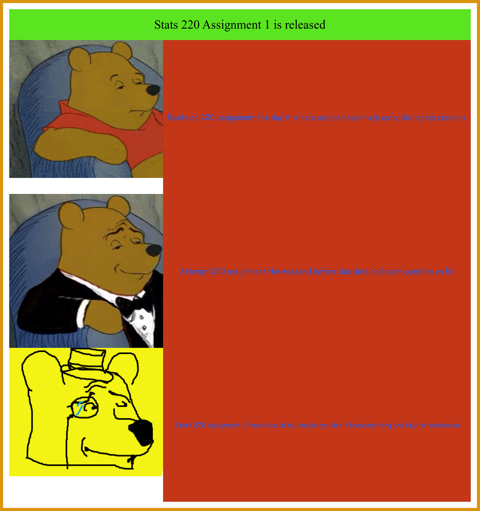

# Welcome to my website!
https://github.com/joshi9999/stats220
## Purpose
The purpose of this repo is to display the work I have done during Stats 220. During the semester I will be adding in more work to highlight my progress across the course. I hope to be a master of GitHub in the future!!

```
Below are information that are required for Assignment 1!
```

## Favourite Fruits in no particular order
1. **Apple**
    1. **Granny Smith**
    2. **Rose**
2. **Pear**
    1. **Asian**
    2. **Bosc**
3. **Watermelon**
## Favourite Animals
- *Dog*
    - *Labrador*
    - *Husky*
- *Cat*
- *Panda*
## My favourite website
My favorite website is [Netflix](https://netflix.com), this is because I am an expert at wasting time
## Favourite Images
### Here is the meme I created

### Here is one of my favourite places in New Zealand, can you guess where it is?

