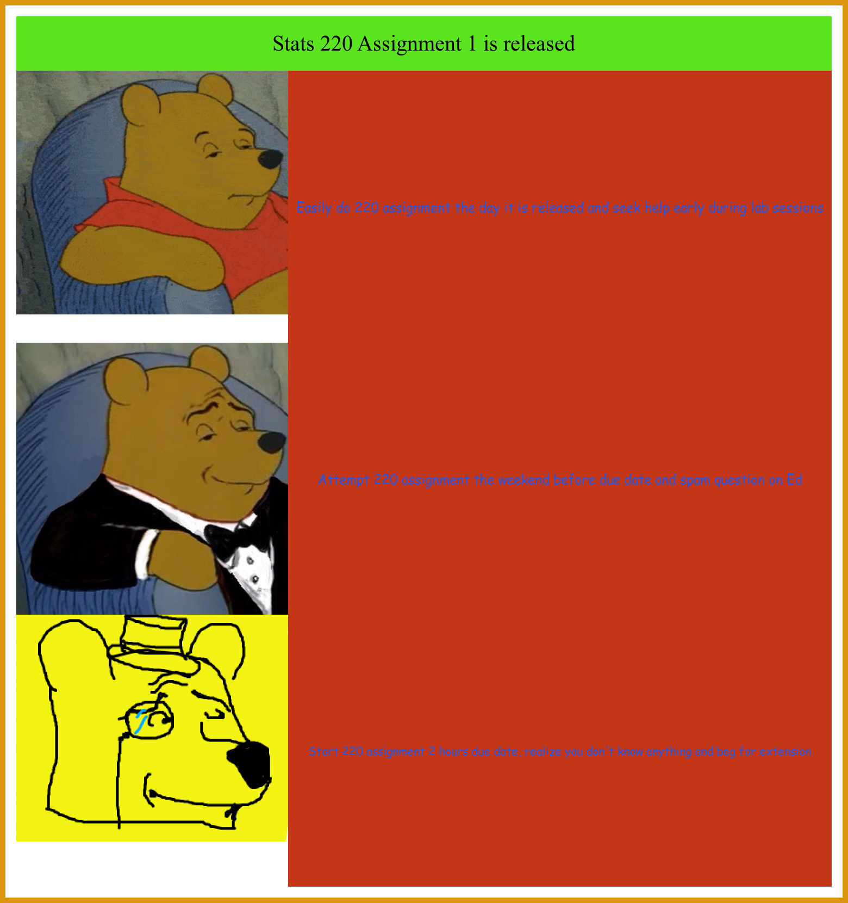

## Here is the Meme I created using R

## Below is the code used to create this meme is you want to replicate it
```
llibrary(magick)

normal_pooh <- image_read("https://uploads.dailydot.com/2019/04/apathetic_winnie-the_pooh.gif?auto=compress&fm=gif&ixlib=php-3.3.0"
) %>%
image_scale(500)
tuxedo_pooh <- image_read("https://uploads.dailydot.com/2019/04/tuxedo_winnie_the_pooh.jpg?auto=compress&fm=pjpg&ixlib=php-3.3.0") %>%
image_scale(500)
monocle_pooh <- image_read("https://cdn.drawception.com/drawings/2zLQXLyKZm.png") %>%
image_scale(500)

title <- image_blank(width = 1500, height = 100, color = "#5BE520") %>% 
  image_annotate(text="Stats 220 Assignment 1 is released",
                 color = "#000000",
                 size = 40,
                 font = "Serif",
                 gravity = "center")
early <- image_blank(width = 1000,
height = 500,
color = "#C33618") %>%
                         image_annotate(text = "Easily do 220 assignment the day it is released and seek help early during lab sessions",
                                        color = "#2456E4",
                                        size = 24,
                                        font = "Comic_Sans",
                                        gravity = "center")
                         middle <- image_blank(width = 1000,
                                                  height = 500,
                                                  color = "#C33618") %>%
                           image_annotate(text = "Attempt 220 assignment the weekend before due date and spam question on Ed",
                                          color = "#2456E4",
                                          size = 24,
                                          font = "Comic_Sans",
                                          gravity = "center")
                         late <- image_blank(width = 1000,
                                                height = 500,
                                                color = "#C33618") %>%
                           image_annotate(text = "Start 220 assignment 2 hours due date, realize you don't know anything and beg for extension",
                                          color = "#2456E4",
                                          size = 21,
                                          font = "Comic_Sans",
                                          gravity = "center")
                         first_row <- c(normal_pooh, early) %>%
                           image_append()
                         second_row <- c(tuxedo_pooh, middle) %>%
                           image_append()
                         third_row <- c(monocle_pooh, late) %>%
                           image_append()
pooh_meme <- c(title, first_row, second_row, third_row) %>%
              image_append(stack = TRUE)


# add border
pooh_meme1 <- image_border(image_background(pooh_meme, "blue"), "#ffffff", "20x20") %>%
  image_border("#DC950E", "10x10")
pooh_meme1
image_write(pooh_meme1, "pooh_meme1.png")
```
## Information about my meme
I created this meme based off the popular Winnie the Pooh meme series as I always thought it was quite funny. I tried to create a meme that is relatable to alot of uni students as I thought it would be more fun. 

I believe this meme is new/original as the idea was created by myself and hopefully no one has created something similar to what I have done!
